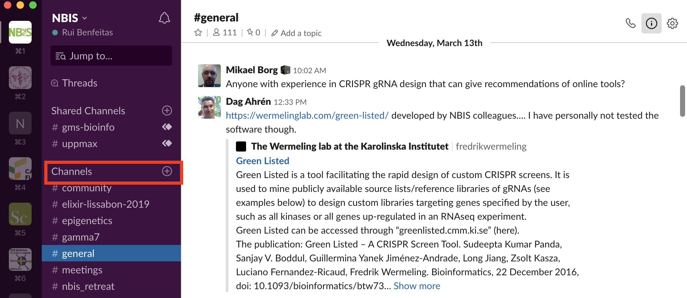
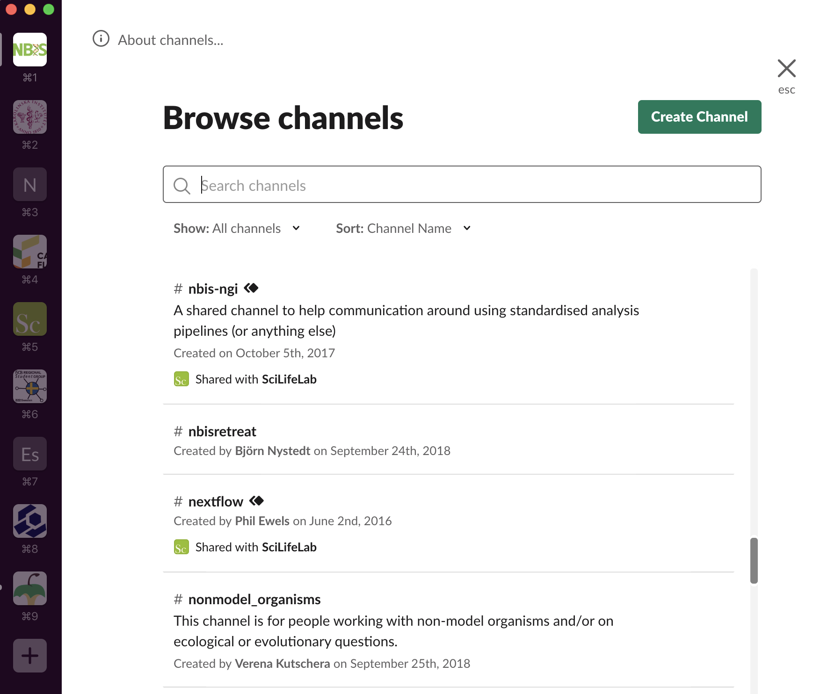

# Intro to Slack

Most of our communications run through [the NBIS slack][nbis-slack]. If you haven't used
Slack, you may have a look [at this introduction][intro-slack]. 

You will be automatically added to some channels including:
- #general - general NBIS information
- #meetings - weekly NBIS meetings (Thursdays at 11am)
- #[your_NBIS_site] - all NBIS sites across Sweden have their own local Slack channel
- #fun - a place for random posts
- #uppmax - joint NBIS / Scilifelab / Uppmax channel for Uppmax support

Other interesting channels relate to specific events and technologies. Examples:
- #reproducible-research
- #training
- #outreach-group
- #r
- #transcriptomics

Feel free to browse the existing channels by pressing *Channels* on the left. All the channels
that you see can be joined by yourself, or you can invite people to join existing channels.

[intro-slack]: https://get.slack.help/hc/en-us/sections/360000110083-Intro-to-Slack
[nbis-slack]: https://nbisweden.slack.com  
